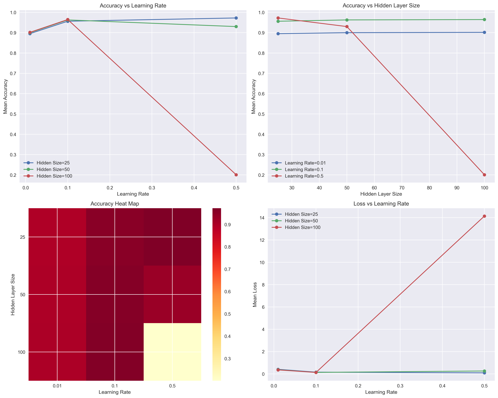

# 手写数字识别实验报告

## 实验概述
- 实验日期：2025-01-14 14:37:42
- 实验时长：0:05:28.016312
- 实验目的：探究不同网络配置对手写数字识别性能的影响

### 实验参数配置
- 隐藏层大小：[25, 50, 100]
- 学习率：[0.01, 0.1, 0.5]
- 每组配置重复次数：3

## 最佳配置结果
- 最佳隐藏层大小：25
- 最佳学习率：0.5
- 最高准确率：0.9725
- 最低损失值：0.0966

## 详细实验数据

### 所有配置结果
| 隐藏层大小 | 学习率 | 平均准确率 | 平均损失 |
|------------|---------|------------|----------|
| 25 | 0.01 | 0.8951 | 0.4132 |
| 25 | 0.1 | 0.9563 | 0.1599 |
| 25 | 0.5 | 0.9725 | 0.0966 |
| 50 | 0.01 | 0.9000 | 0.3768 |
| 50 | 0.1 | 0.9628 | 0.1375 |
| 50 | 0.5 | 0.9301 | 0.2630 |
| 100 | 0.01 | 0.9016 | 0.3609 |
| 100 | 0.1 | 0.9646 | 0.1332 |
| 100 | 0.5 | 0.2008 | 14.1421 |

## 可视化结果
### 性能对比图

## 结论与建议

### 主要发现
1. 最佳性能配置为隐藏层大小 25，学习率 0.5
2. 平均准确率达到 0.9725

## 附录

### 实验环境
- Python版本：3.8.20
- 主要依赖包版本：
  - NumPy: 1.24.4
- Matplotlib: 3.7.3
